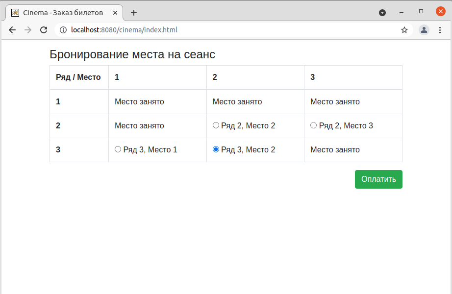
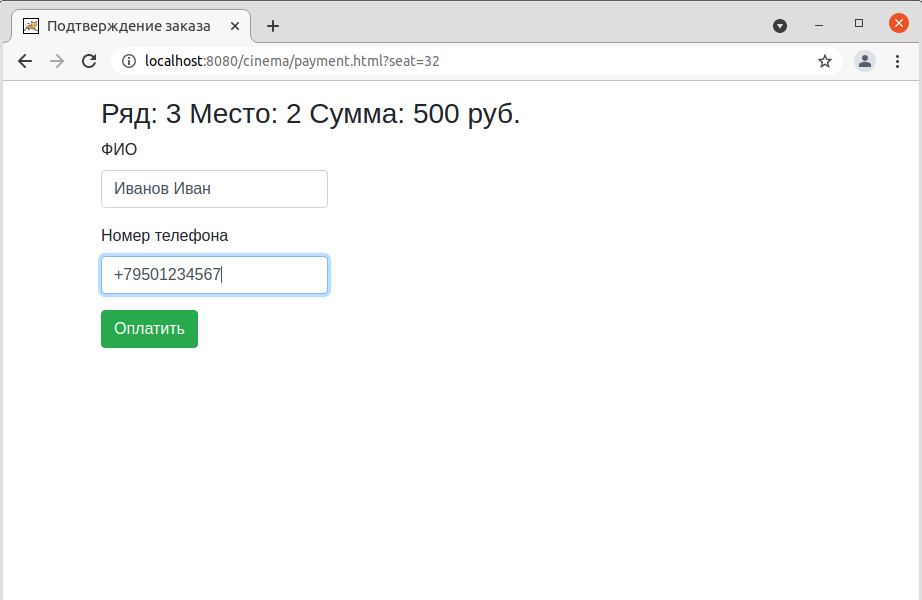
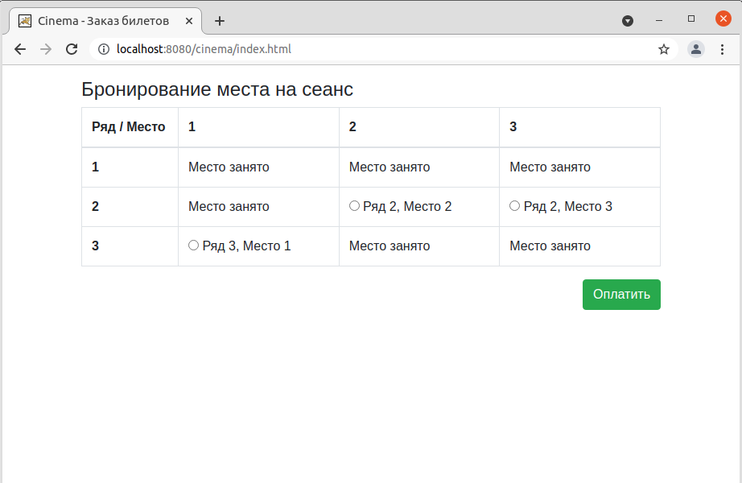

# Приложение "Cinema"

## О проекте
Приложение для онлайн бронирования и покупки билетов в кинотеатр. 
Пользователь выбирает свободное место в зале, вводит свои контактные данные и автоматически
регистрируется в системе. Забронированное место меняет свой статус со "Свободно" на "Занято" и перестаёт быть 
доступным для покупки на главной странице.

## Сборка
JDK14, Maven, PostgreSQL, Tomcat

## Как использовать
На главной странице выбираете нужное вам место в зале и нажимаете кнопку
"Оплатить".

Вводите свои данные: ФИО и номер телефона и нажимаете кнопку "Оплатить".
При покупке билета происходит автоматическая регистрация пользователя с
привязкой к купленному билету.

Затем происходит переадресация на главную страницу, с учетом бронирования 
указанного места.

## Контакты
Кутявин Владимир

email: tribuna87@mail.ru

skype: tribuna87